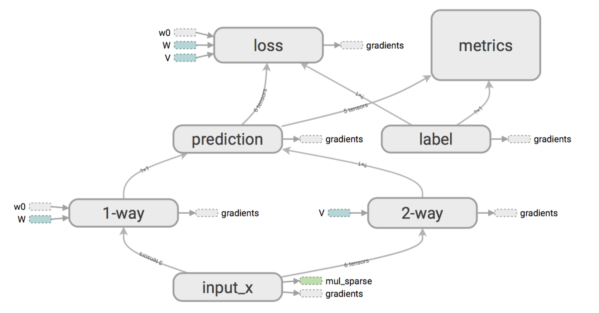

# Factorization Machine
Factorization Machine in tensorflow.  
Compatible with python2 and python3.  
Tested on:  
- tensorflow v1.4.1 & v1.8.0  
- CPU & GPU  
- py2.7 & py3.6

## Model Structure
 

## Example
```
python train_example.py
python restore_example.py
tensorboard --logdir=tensorboard_log/
```

## Functions
- FM Core  
  train_step(sess, input_x, input_y, lr)  
  eval_loss(sess, input_x, input_y)  
  get_embedding(sess, input_x) 

- FM Classifier  
  predict_proba(sess, input_x)  
  eval_auc(sess, input_x, input_y)

- FM Regressor  
  predict(sess, input_x)


## Reference:
- [Factorization Machine](https://www.csie.ntu.edu.tw/~b97053/paper/Rendle2010FM.pdf)
